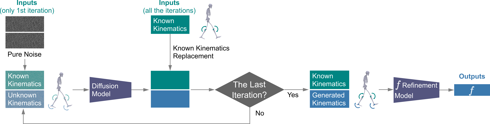

# GaitDynamics: A Foundation Model for Analyzing Gait Dynamics 
By Tian Tan, Tom Van Wouwe, Keenon F. Werling, C. Karen Liu, Scott L. Delp, Jennifer L. Hicks, and Akshay S. Chaudhari

## Summary
GaitDynamics is a generative foundation model for general-purpose gait dynamics prediction.
We illustrate in three diverse tasks with different inputs, outputs, and clinical impacts: i) estimating 
external forces from kinematics, ii) predicting the influence of gait modifications on knee loading without human 
experiments, and iii) predicting comprehensive kinematics and kinetic changes that occur with increasing running 
speeds.

## Environment
Our code is tested with: numpy 1.23.5; Python 3.9.16; PyTorch 1.13.1; CUDA 11.6; cuDNN 8.3.2.

## Trained model
GaitDynamics has [a diffusion model](/example_usage/GaitDynamicsDiffusion.pt) and 
[a force refinement model](/example_usage/GaitDynamicsRefinement.pt).
Downstream task 1 uses both models, while downstream task 2 and 3 use only the diffusion model.

## Force and kinematic estimation with GaitDynamics
<span style="color:#cc0000;font-weight:bold;">&lt;new&gt;</span> [A Huggingface Demo](https://huggingface.co/spaces/alanttan/GaitDyanmics/) and
 [A Google Colab notebook](https://colab.research.google.com/drive/1n6kH3gnwLdQ2DH5krigbkiO06NjDtyxI?usp=sharing)
are provided for estimating ground reaction forces and missing kinematics using flexible combinations of kinematic inputs.
Upload an OpenSim model file (.osim) and kinematic data files (.mot) following the instructions in the notebook.
Example files can be found in the [example_usage](/example_usage) folder.

## Dataset
[AddBiomechanics Dataset](https://addbiomechanics.org/download_data.html)

## Demo Videos
**Downstream Task 1: estimating forces using kinematic inputs.**

https://github.com/user-attachments/assets/7a760398-d517-4e56-b20c-e2d316574a27

---

**Downstream Task 2: predicting reduction in knee adduction moment during trunk sway gait without experiments.**

https://github.com/user-attachments/assets/a0d525d4-53e7-4ee6-b830-d4b2825f152c

---

**Downstream Task 3: gait generation at various running speeds.**

https://github.com/user-attachments/assets/69f03b3d-7bb2-4c26-b94d-a28a4ea803d6

## Methods

<p align="center">
  
</p>

Data window and training. Each sample is a 2D window: time (1.5 s) × parameters (body center velocity, joint angles,
joint angular velocities, and forces). GaitDynamics comprises a diffusion model and a force refinement model. The
diffusion model learns to denoise windows, whereas the refinement model maps full-body kinematics to forces.

---



Force estimation from partial-body kinematics. The diffusion model first generates unknown kinematics via inpainting. Then full-body kinematics
are passed to the refinement model to estimate forces.

---


Experiment-free prediction of knee adduction moment during walking with large medial–lateral trunk sway. The process is
similar to that in the figure above, with two differences. First, inputs are synthetic medial–lateral trunk sway. Second, an additional loss penalizes large discrepancies between synthetic gait and model generations. Finally, based on the generated kinematics and forces, the knee adduction moment is
computed from the cross product of the force vector and the lever arm vector.

## Acknowledgement

This work was supported in part by the Joe and Clara Tsai Foundation through the Wu Tsai Human Performance Alliance and the U.S. National Institutes of Health (NIH) under Grants P41 EB027060, P2C HD101913, R01 AR077604, R01 EB002524, and R01 AR079431.

## BibTex

```bibtex
@article{tan2025gaitdynamics,
  title={GaitDynamics: A Generative Foundation Model for Analyzing Human Walking and Running},
  author={Tan, Tian and Van Wouwe, Tom and Werling, Keenon and Liu, C Karen and Delp, Scott and Hicks, Jennifer and Chaudhari, Akshay},
  journal={Research Square},
  pages={rs--3},
  year={2025}
}
```

## Publication
This repository includes the code and models for a [preprint](https://assets-eu.researchsquare.com/files/rs-6206222/v1_covered_f6a08d22-5432-4743-b062-b8b8d886d664.pdf?c=1742524004)
and an [abstract](./figures/readme_fig/Tan_ASB2024.pdf).
