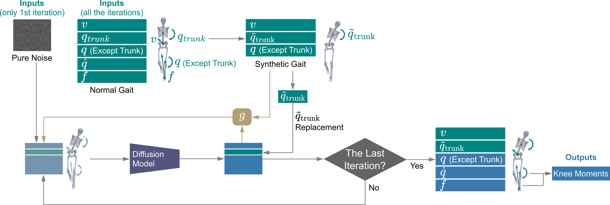

# GaitDynamics: A Foundation Model for Analyzing Gait Dynamics 
By Tian Tan, Tom Van Wouwe, Keenon F. Werling, C. Karen Liu, Scott L. Delp, Jennifer L. Hicks, and Akshay S. Chaudhari

## Exclusive Summary
GaitDynamics is a generative foundation model for general-purpose gait dynamics prediction.
We illustrate in three diverse tasks with different inputs, outputs, and clinical impacts: i) estimating 
external forces from kinematics, ii) predicting the influence of gait modifications on knee loading without human 
experiments, and iii) predicting comprehensive kinematics and kinetic changes that occur with increasing running 
speeds.

## Environment
Our code is developed under the following environment. Versions different from ours may still work.

Python 3.9.16; Pytorch 1.13.1; Cuda 11.6; Cudnn 8.3.2; numpy 1.23.5;

## Trained model
GaitDynamics has [a diffusion model](/example_usage/GaitDynamicsDiffusion.pt) and 
[a force refinement model](/example_usage/GaitDynamicsRefinement.pt).
Downstream task 1 uses both models, while downstream task 2 and 3 use only the diffusion model.

## Force estimation with GaitDynamics
[A Google Colab notebook](https://colab.research.google.com/drive/1n6kH3gnwLdQ2DH5krigbkiO06NjDtyxI?usp=sharing)
is provided for estimating ground reaction forces and missing kinematics using flexible combinations of kinematic inputs.
Upload an OpenSim model file (.osim) and kinematic data files (.mot) following the instructions in the notebook.
Example files can be found in the [example_usage](/example_usage) folder.

## Dataset
[AddBiomechanics Dataset](https://addbiomechanics.org/download_data.html)

## Demo Videos

Below are demo videos of the three downstream tasks.

### Downstream Task 1: Force Estimation
**Estimating forces using kinematic inputs.** The ability to accurately estimate forces during gait from kinematics would transform biomechanics and healthcare, facilitating applications such as remote rehabilitation, exoskeleton control, and running injury prevention.

https://github.com/user-attachments/assets/your-da1-video-asset-id

### Downstream Task 2: Knee Adduction Moment Prediction  
**Predicting reduction in knee adduction moment during trunk sway gait without experiments.** Increasing medial-lateral trunk sway during walking can reduce knee adduction moments, which are associated with medial compartment knee osteoarthritis.

https://github.com/user-attachments/assets/your-da2-video-asset-id

### Downstream Task 3: Running Speed Dynamics
**Predicting comprehensive kinematics and kinetic changes that occur with increasing running speeds.**

https://github.com/user-attachments/assets/your-da3-video-asset-id

## Methods

### Model Architecture


The data window and training of GaitDynamics. The data is a 2-D window with a 1.5-second time dimension and a parameter dimension. The parameter dimension includes body center velocity, joint angles, joint angular velocities, and forces. GaitDynamics has one diffusion model and one force refinement model. The diffusion model is trained to recursively restore the clean windows from the windows with different amounts of noise, whereas the refinement model is trained to map full-body kinematics to forces.


Force estimation using GaitDynamics with partial-body kinematics as input. GaitDynamics generates unknown kinematics using inpainting, where the diffusion model recursively denoise the data window based on the known portion. The inpainting begins by denoising pure Gaussian noise. Then, the denoised data window (unknown kinematics only) is concatenated with known kinematics and diffused to the noisy data window of the next iteration following a Markov chain. Subsequently, the same generation, concatenation, and diffusion processes are iteratively applied to the data window for a total of 50 iterations, where the quality of generation gradually increases. Finally, the unknown kinematics generated in the last iteration are concatenated with known kinematics and fed into the refinement model to estimate forces.



Experiment-free prediction of knee adduction moment during walking with large medial-lateral trunk sway angles. The process is similar to the inpainting described in the above figure, with two differences. First, instead of using experimental data as input, manipulated gait data with times larger medial-lateral trunk sway are used as input. Second, a loss function g is used to regularize large discrepancies in and for each iteration. Discrepancies larger than a threshold are back-propagated to refine the noisy motion using gradient descent optimization. Finally, based on the generated kinematics and forces, we computed the knee adduction moment using the cross product of the force vector and the lever arm vector from the knee joint center to the center of pressure.

## Acknowledgement

This work was supported in part by the Joe and Clara Tsai Foundation through the Wu Tsai Human Performance Alliance and the U.S. National Institutes of Health (NIH) under Grants P41 EB027060, P2C HD101913, R01 AR077604, R01 EB002524, and R01 AR079431.

## BibTex

```bibtex
@article{tan2025gaitdynamics,
  title={GaitDynamics: A Generative Foundation Model for Analyzing Human Walking and Running},
  author={Tan, Tian and Van Wouwe, Tom and Werling, Keenon and Liu, C Karen and Delp, Scott and Hicks, Jennifer and Chaudhari, Akshay},
  journal={Research Square},
  pages={rs--3},
  year={2025}
}
```

## Publication
This repository includes the code and models for a [preprint](https://assets-eu.researchsquare.com/files/rs-6206222/v1_covered_f6a08d22-5432-4743-b062-b8b8d886d664.pdf?c=1742524004)
and an [abstract](./figures/readme_fig/Tan_ASB2024.pdf).
